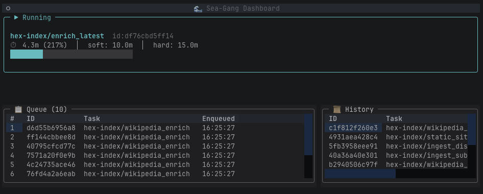
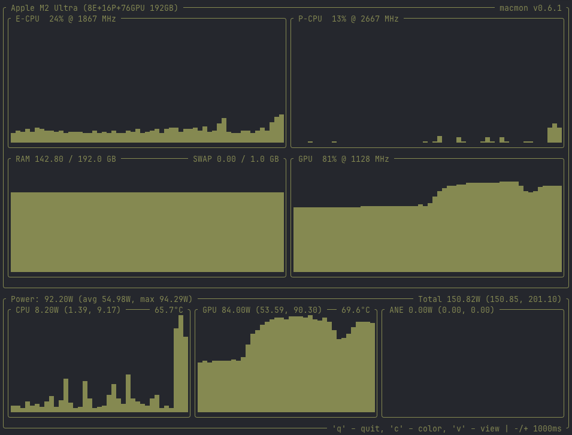

# 🌊 Sea-Gang

Lightweight serial task orchestrator — protects shared Ollama/Mistral resources by running tasks one at a time, with intelligent timeout management and queue backpressure.

## Why?

When multiple projects share a single local Ollama instance, concurrent LLM calls will serialize and slow everything down. Sea-Gang ensures:

- **Serial execution** — one task at a time, no Ollama contention
- **Zero idle cost** — no LLM calls for orchestration itself  
- **Smart timeouts** — soft timeout checks if the task is still producing output before killing
- **Backpressure** — rejects new tasks when the queue gets too deep
- **Priority queuing** — fast tasks (healthcheck, stats) jump ahead of slow tasks (enrichment)
- **Full observability** — rich CLI, TUI dashboard, JSON output, log files, timing statistics

## Live Dashboard

The Textual-based TUI gives real-time visibility into what sea-gang is doing. Here it's running a Wikipedia enrichment job — writing a deep-dive article using Ollama with `mistral-large:123b`. The queue shows 10 more enrichment jobs waiting, each processing one article at a time to avoid resource contention.



The progress bar shows the current job at 217% of its expected time (4.3 minutes vs 2 minute estimate). Sea-gang doesn't kill it yet — the soft timeout system checks if the task is still producing output before deciding to terminate. The queue and history panels make it easy to see what's pending and what's already completed.

## GPU Utilization

While sea-gang orchestrates, the actual work happens on-device. Here's `macmon` showing the Apple M2 Ultra during an enrichment run — the GPU is at 81% utilization, pulling 84W as Mistral-large (123B parameters) generates Wikipedia-style articles from Substack content. No cloud API calls, no per-token billing — just raw local inference.



The M2 Ultra's 76-core GPU keeps the full 123B parameter model in its 192GB unified memory. CPU stays low at 13-24% — sea-gang's orchestration overhead is negligible compared to the inference workload.

## Quick Start

```bash
# Activate the environment
source .venv/bin/activate

# See configured projects
sea-gang projects

# Submit a task
sea-gang submit hex-index healthcheck

# Run it (process one job and exit)
sea-gang run --once

# Check status
sea-gang status

# View history
sea-gang history

# Start the daemon (with cron scheduler)
sea-gang run
```

## CLI Commands

| Command | Description |
|---------|-------------|
| `sea-gang status` | Dashboard: current job, queue depth, recent completions |
| `sea-gang queue` | List pending jobs (`--watch` for live view) |
| `sea-gang history` | Recent completed/failed/killed jobs |
| `sea-gang submit <project> <task>` | Manually enqueue a task |
| `sea-gang kill [job_id]` | Kill the currently running job |
| `sea-gang remove <job_id>` | Remove a pending job |
| `sea-gang move <job_id> <pos>` | Reorder a job in the queue |
| `sea-gang clear` | Remove all pending jobs |
| `sea-gang logs [job_id]` | Tail job output (`-f` to follow) |
| `sea-gang stats` | Per-task timing statistics (avg, p95, max) |
| `sea-gang projects` | List configured projects and tasks |
| `sea-gang healthcheck <project>` | Run pre-flight checks |
| `sea-gang run` | Start runner + scheduler daemon |
| `sea-gang run --once` | Process one job and exit |

All commands support `--json-output` for machine consumption.

## Timeout Strategy

```
soft_timeout ──── Is it still producing output? ──── YES → extend
                                                 └── NO  → Is runtime < p95? ── YES → extend
                                                                              └── NO  → KILL (killed_soft)

hard_timeout ──── KILL unconditionally (killed_hard)
```

## Adding Projects

Create a YAML file in `~/.config/sea-gang/projects/`:

```yaml
project:
  name: my-project
  working_dir: /path/to/project
  
  env:
    MY_VAR: "value"
  
  healthchecks:
    - name: check-name
      command: "some check command"
      expect_exit_code: 0

  tasks:
    my-task:
      command: "npm run something"
      soft_timeout_minutes: 30
      hard_timeout_minutes: 60
      expected_minutes: 15
      schedule: "0 6 * * *"  # optional cron
```

## Architecture

- **Python 3.13** + pyenv
- **SQLite** for job queue and statistics (no external deps)
- **APScheduler** for cron triggers
- **Rich** + **Click** for CLI
- **subprocess** for task execution with process group management
